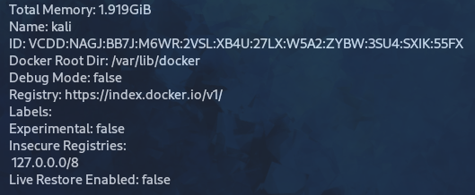

# Установка Docker в Kali Linux

Порядок установки взят из официальной документации Kali:

```
https://www.kali.org/docs/containers/installing-docker-on-kali/
```

1. Обновление сведений из репозиториев:

```
sudo apt update
```

2. Установка docker.io

```
sudo apt install -y docker.io
```


3. Включение автозагрузки сервиса:

```
sudo systemctl enable docker --now
```
 


4. Получение сведений об установленной версии:

```
docker -v
```


либо дополнительных сведений:

```
docker info
```

---


5. Теперь можно приступить к использованию docker с sudo. Если необходимо добавить себя
в группу docker для использования docker без sudo, потребуется дополнительный шаг:

```
sudo usermod -aG docker $USER
```
Последнее, что нужно сделать, - выйти из системы и снова войти.
