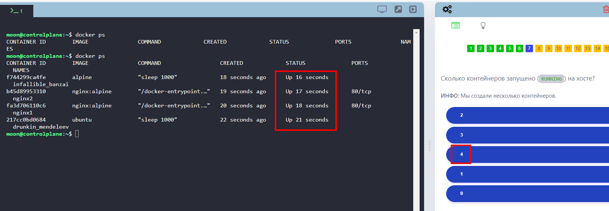
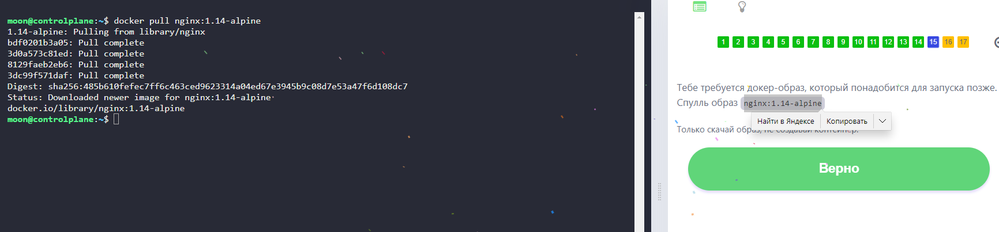

# Лабораторная работа № 1. Основные команды Docker. 

Узнать версию программы:

```
docker -v
```


Узнать количество работающих контейнеров на хосте:

```
docker ps
```


Узнать количество образов на хосте:

```
docker images
```


Запустить контейнер из образа:

```
docker run redis
```
 


Остановить только что созданный контейнер:

```
Ctrl+C
```


Узнать, сколько контейнеров запущено на хосте:

```
docker ps
```


Узнать сколько контейнеров всего на хосте, включая запущенные и остановленные:

```
docker ps -a
```


Узнать, какой образ использован для запуска контейнера:

```
docker ps -a
```


Узнать название контейнера, собранного из определенного образа:

```
docker ps -a
```


Узнать ID контейнера, собранного из определенного образа:

```
docker ps -a
```


Узнать состояние остановленного контейнера:

```
docker ps -a
```


Удалить все контейнеры с хоста:

```
docker stop $(docker ps -a -q) && docker rm $(docker ps -a -q)
```


Удалить определенный образ:

```
docker rmi ubuntu
```


Скачать определенный образ без его запуска:

```
docker pull nginx:1.14-alpine
```


Запустить контейнер с определеного образа и присвоить ему название:

```
docker run --name webapp nginx:1.14-alpine
```


Удалить все образы на хосте (для этого нужно остановить все контейнеры и удалить их):

```
docker stop $(docker ps -a -q) && docker rm $(docker ps -a -q) && docker rmi $(docker images -a -q)
```

		
