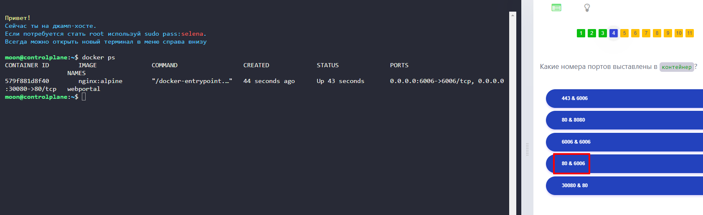
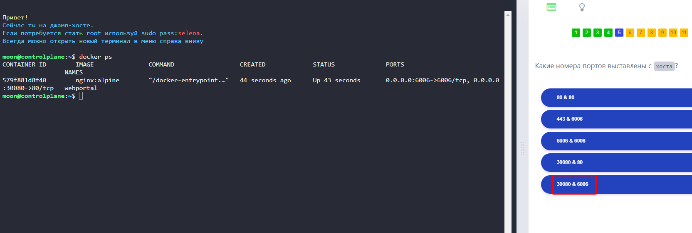
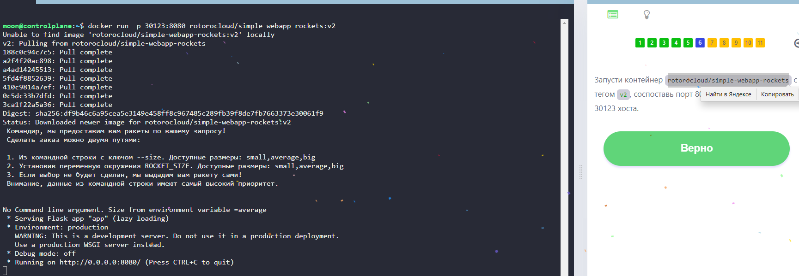
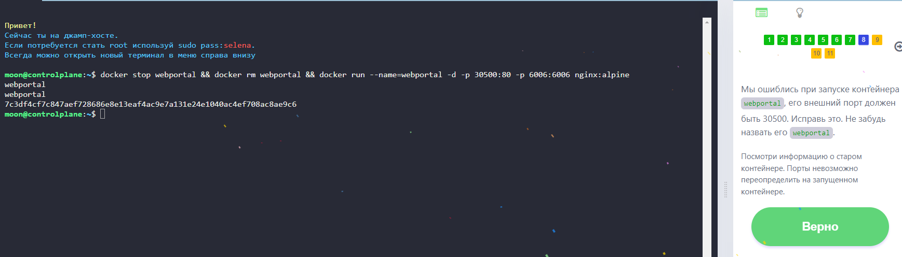
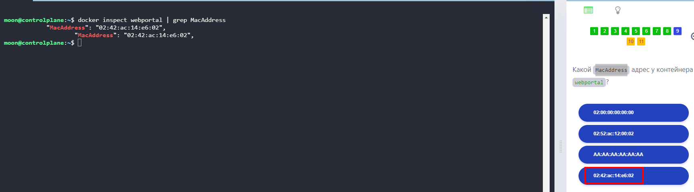
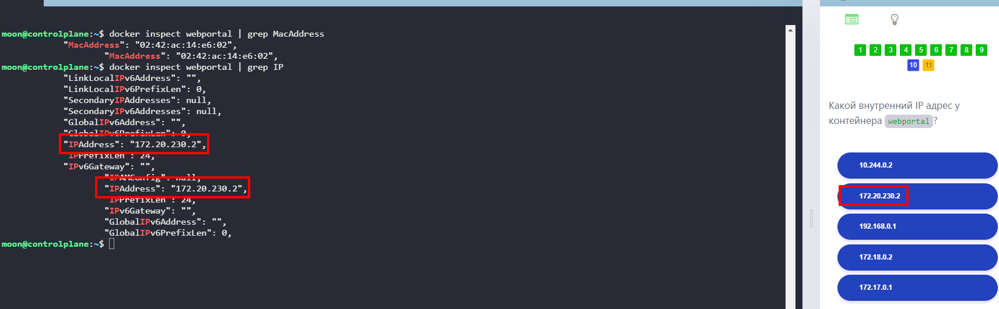
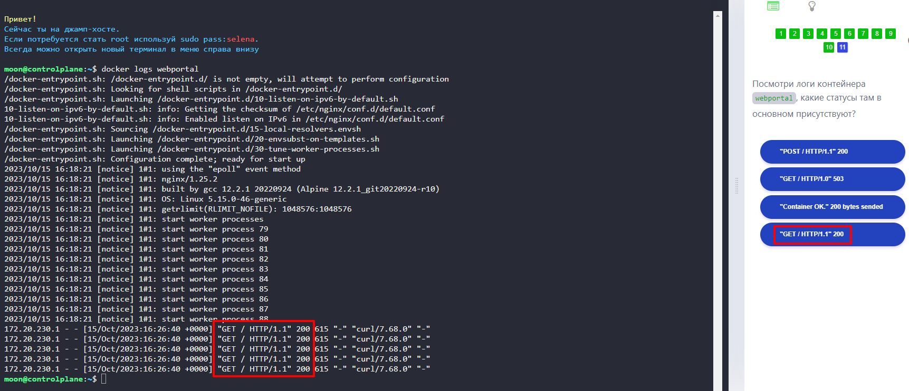

# Лабораторная работа № 2. Параметры команды docker run. 

1. Узнать, какие номера портов выставлены в контейнер:

```
docker ps
```


2. Узнать, какие номера портов выставлены на хосте:

```
docker ps
```


3. Запустить контейнер с тегом с сопоставлением портов на хосте и контейнере:

```
docker run -p hostport:containerport containername:tag
```

---


4. Пересоздать контейнер с названием и необходимыми портами:

```
docker stop containername && docker rm containername && docker run --name=containername -d -p hostport:containerport -p hostport:containerport containername
```
 


5. Узнать mac-address контейнера:

```
docker inspect containername | grep MacAddress
```


6. Узнать внутренний IP контейнера:

```
docker inspect containername | grep IP
```


7. Посмотреть логи контейнера:

```
docker logs containername
```


